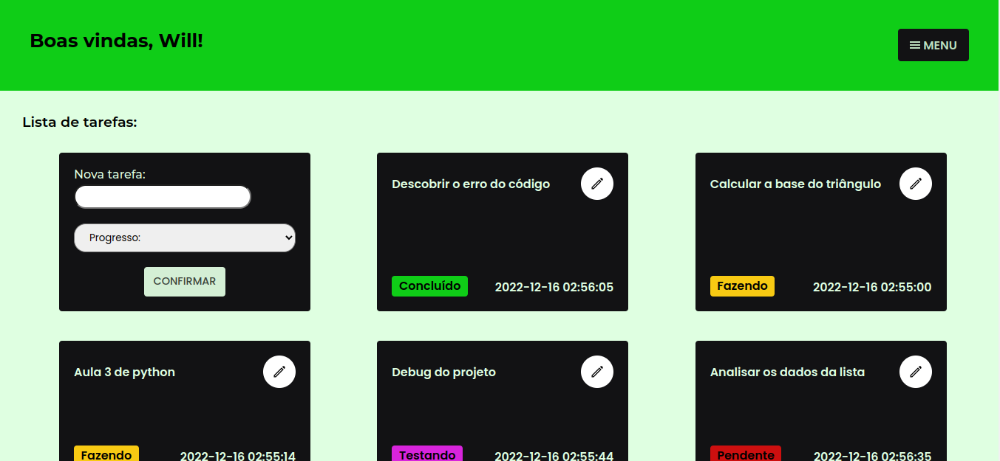

# Repositório Front-End Task Scheduler.



# Sumário

- [Pré-requisitos](#pré-requisitos)
- [Como funciona este projeto](#explicações-gerais)
- [Como rodar o projeto](#como-rodar-o-projeto)


  
  # Pré-requisitos
  
  Para que o projeto funcione sem problemas, você precisa ter:
  
- [Node.js](https://docs.npmjs.com/downloading-and-installing-node-js-and-npm);
- [Git](https://git-scm.com/book/pt-br/v2/Come%C3%A7ando-Instalando-o-Git);
- [Npm](https://docs.npmjs.com/downloading-and-installing-node-js-and-npm) ou [Yarn](https://yarnpkg.com/getting-started/install);

Use algum programa shell (ou linha de comando) para criar um novo diretório em sua máquina:

```
mkdir kanbanSchedulerFront
```

Navegue para dentro deste diretório e realize o clone do repositório:

```
cd kanbanSchedulerFront
```

```
git@github.com:manupilation/Kanban-Front.git
```

É importante lembrar que:
Para rodar o front-end do Kanban, você precisa estar com o backend kanban em funcionamento na máquina, especificamente na rota 3001.
Confira aqui o [KanbanBack](https://github.com/manupilation/Kanban-Backend).

# Explicações gerais

O propósito deste projeto é gerenciar um app de tarefas ao estilo "Kanban". Você pode logar (se estiver registrado no sistema) ou se registrar.
As stacks utilizadas no projeto foram:

- React
- React-Router-DOM
- Vite
- Eslint
- SASS
- ContextApi


A página principal do projeto é a de tasks, porém a mesma só pode ser acessada se você estiver logado. Na página de login (caso você já esteja registrado),
digite seu email e senha.
Você será redirecionado à pagina de tasks. O primeiro Card da página é um pequeno formulário, onde facilmente você pode registrar novas tasks com suas
especificações.

O Card contém a tarefa a ser feita, a data em que foi iniciada, seu status atual e um botão interativo. Este botão irá ativar o primeiro card como formulário
de atualização do card clicado.

     
# Como rodar o projeto
     
 Para rodar o projeto, basta estar no diretório que criamos e clonamos e rodar os comandos:
```
npm install
```
     
```
npm run dev
```
